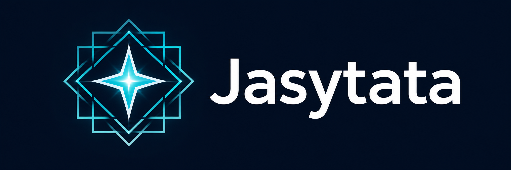

<p align="center">
  
</p>

# Jasytata

[](https://github.com/elacerda/jasytata/releases) [](https://elacerda.github.io/jasytata/) [](https://github.com/elacerda/jasytata/actions/workflows/pages.yml) [](LICENSE)

**Jasytata is a browser-based telescope/survey pointing and coverage planner.**

Extend an existing pointing catalogue or start a **new project with no initial
catalogue**. S-PLUS/T80-South is the bundled reference/default profile;
user-defined instrument and survey profiles supply other geometries and policies.

**Live application:** <https://elacerda.github.io/jasytata/>

React/TypeScript/Vite runs catalogue parsing, planning, coverage and export in
the browser. GitHub Pages serves the static application: no API backend or
database is required. Aladin Lite supplies the sky map and accesses external
astronomy/HiPS imagery services.

Jasytata takes its name from a Kaiowá word recorded for “star”.

## What you can plan

- Rectangle, circle, polygon and compound/mosaic instrument footprints, including
  camera position angle and detector offsets/rotations.
- Generic lattices with rectangular, rotated, staggered or triangular center
  layouts, or manual/imported pointings. Basis vectors encode lattice orientation
  independently of camera PA.
- Mixed catalogues with their own **Catalogue instrument** assignment and
  **Inference participation**. Source footprints contribute coverage independently
  of their use as inference evidence.
- **Complete coverage** targeting every selected sample, or **Efficient coverage**
  stopping according to the active survey's coverage/marginal-efficiency policy.
- Browser profile authoring, strict Schema v2 JSON import/export, reversible
  proposal review, and CSV export of enabled accepted pointings using the active
  survey's column/coordinate/epoch/PA/identifier/constant-field policy.

## Typical workflow

1. Use the bundled profile, **Import profile**, or **Create profile**.
2. Optionally **Load catalogue** (or **Load reference** for the bundled T80 example).
3. Assign each catalogue's instrument and choose its inference participation.
4. Select the **Active survey** for output.
5. **Select area**, draw the region, and choose Complete or Efficient.
6. **Generate plan**, review, **Accept proposal**, and disable/restore tiles as needed.
7. **Download new_tiles.csv** under the survey's export policy.

Without catalogues, start at profile selection and draw a region. Manual surveys
use **Single tile** or **Import centers** and coverage review instead of automatic
region tiling. Profiles and plans live in the browser session; save profiles as
JSON and accepted pointings as CSV before reloading.

## Scientific scope and limits

Generic inference aligns existing centers to the profile's declared fundamental
lattice; it does not discover an arbitrary lattice. The bundled T80 profile
preserves its established observer workflow and grouping/inference behavior.

Coverage is a scale-aware, uniformly sampled local-plane estimate, **not exact
analytic geometry**. Sub-pitch structure may be unresolved; extreme sample-budget
coarsening reduces accuracy, and threshold decisions can depend on sampling.
Local tangent-plane approximations limit large fields and extreme polar regimes,
which are outside validated precision. Complete can still leave gaps when the
available lattice sites cannot cover them.

Jasytata is not an observing scheduler. Exposure-time optimization, filter
sequencing, airmass, Moon constraints, weather, mount constraints, queue scheduling
and observatory control are out of scope.

## Development

Requirements: Node.js 24 LTS (or a compatible supported Node.js release) and npm.

From the repository root:

```bash
make setup
make dev
make check
```

Development runs at <http://localhost:5173/>. To test the production artifact
with the GitHub Pages path layout:

```bash
make build
rm -rf /tmp/jasytata-local
mkdir -p /tmp/jasytata-local/jasytata
cp -a frontend/dist/. /tmp/jasytata-local/jasytata/
cd /tmp/jasytata-local
python3 -m http.server 4173
```

Open <http://localhost:4173/jasytata/>. Production builds use `/jasytata/`.

## Deployment

GitHub Actions validates and builds pushes to `main`, then deploys
`frontend/dist` to GitHub Pages.

## Documentation

- [User guide — T80-South](docs/T80_SOUTH_USER_GUIDE.md)
- [Profile Schema](docs/PROFILE_SCHEMA.md)
- [Scientific and planning algorithms](docs/ALGORITHM.md)

## License

MIT. Copyright (c) 2026 Eduardo Lacerda. See [LICENSE](LICENSE).
